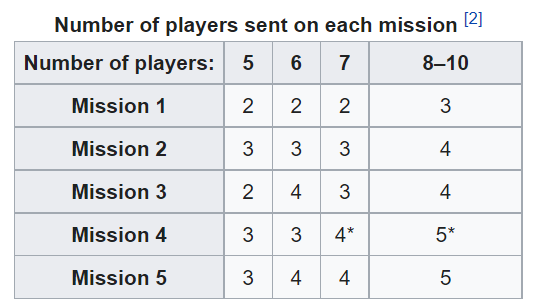

### Spy Spy Multiplayer Game

## Project Description

A turn based multiplayer spy-spy game. The game allows several players to navigate to a site (later in a mobile app) and to select a server with their friends. The game UI shows visually to the player what is happening in the game, whose turn it is etc. 

## Game Logic

-	One third of players (rounded up) are selected to be spies. 
-	One player is randomly selected to be the mission leader. 
-	Resistance “closes eyes” and the spies are made aware of each other.
-   There are 5 missions and the number of players going on each mission is determined according to the following:

- The leader selects the players to send on the mission. The players discuss the leaders choice of players to send on the mission and then simultaneously vote whether to accept the mission or not. 
- If a majority of players vote no or if it is a tie then the leadership passes on to the next player to the left. This repeats until the majority of players agree to go on the mission.
- If players disagree to go on the mission 5 times in a row, then the spies automatically win. 
- Once players go on a mission the ones on the mission are given mission cards – “Pass mission” or “Fail mission”. Resistance players can only play “Pass mission cards” whilst spies can play either. 
- Cards are shuffled and then revealed. If all cards show “Pass” then the resistance earns one point. If one card is a “Fail” then the spies have sabotaged the mission and they gain the point. 
- The game continues until one team accumulates 3 points. 

## What do I want to learn from the project?

- Node.js and socket.io for the backend
- Typescript everywhere
- Eventually React Native 
- Test driven development with Jest 
- Using Tailwind css or material UI
