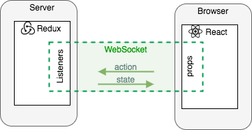

## Development Log

### Project setup 

Kind of been stuck in tutorial hell a little bit. I like tutorials but I get bored of them very easily because I feel like I'm not making enough progress. I would rather just build something and learn as I go. With that said I am now trying to get the project set up so I can have express serve up React with typescript. 

This [article](https://nils-mehlhorn.de/posts/typescript-nodejs-react-ssr) article seems to give a good overview of what I want to do. 

Next I want to get Jest setup so that I can write unit tests. I'll try the guide for getting setup with webpack [here](https://jestjs.io/docs/webpack)

## Room creation and joining

I've been reading a few articles and watching a lot of videos but structuring the application is a bit of a grey area for me still. There is a lot of content about simple chat applications but not much on how to structure a turn based multiplayer game. At this point grey areas for me specifically are:
- how to structure the code (I think MVC is a good choice but how does socket work in this context?)
- how does routing take place. Does the frontend do that or does the backend do that? After all this is a single page application. My guess is that the front end does that maybe.

I'll start with something basic and just go along with it. If my approach is not optimal I will learn something from it so that is okay. My goal now: 

- click create room
- this sends an event to the server. Server generates a roomcode and stores it in some datastore serverside and then sends this code back to the frontend telling it to redirect the app to route /room=XXXXX.
- A socket room will have to be created corresponding to the room code.
- on the homepage entering the code sends this code to the server which checks if it is one of the roomcodes which exists currently and if it is it routes the player to the same route /room=XXXXX
- Backend will have to keep track of the connected clients in a room. Better to use an [object](https://stackoverflow.com/questions/63038016/most-efficient-way-to-store-and-access-list-of-clients-in-sockets-io-node-js)

Useful links:
- [Using commonJS modules in typescript](https://medium.com/@steveruiz/using-a-javascript-library-without-type-declarations-in-a-typescript-project-3643490015f3)

Had a lot of trouble actually testing sockets. [This example](https://socket.io/docs/v4/testing/) was eventually what I used to get it to work. Ran into 'openHandler' issues with Jest.

Have made some progress on testing with sockets. Now I need to think about how the routing will work. 
I'm not sure if this ought to be done on the client side or on the server side. I think both would be valid approaches. Maybe just depends on where I want to shift the complexity, to the frontend or to the backend.

After thinking about the problem a bit more closely I now feel that server-side rendering actually offers no advantage in this particular situation. Frontend and backend can be completely uncoupled apart from a socket.io layer in between. To that end I have been thinking of a way that I can share the state between the client and backend. I basically want to emit events from the client side, process them accordingly on the back-end and update the state and have the client-side consume the state whenever it changes. I found an interesting three part series by valerii-udodov which formulates what I want to do quite well. Link to the [article](https://valerii-udodov.com/posts/server-side-redux/server-side-redux-3-the-code/) and to the [github repository](https://github.com/vudodov/tic-tac-toe-redux-example). Going to clone this repository and play around with this for a little bit trying to get a clearer idea of if this approach will scale in my own application. 

Another thing to think about is scalability. In the example above if I have a load balancer and run multiple instances of Node.js then the store is going to be duplicated multiple times. 
Ideally only want one place where the data is stored and multiple node processes can access it. I.e "shared state". However for the purposes of this project I just want to practise some fullstack development so I am not going to worry about that too much. 

Now have a bit of restructuring to do. I'll use create-react-app on the front-end. No need for such a fancy SSR setup with custom spun webpack -> Okay done, project is working with create-react-app on frontend but nothing is server side rendered anymore which is fine. 

Looking at Redux-Toolkit for redux on the backend. [this](https://www.youtube.com/watch?v=9lCmbth63k0) seems like a pretty solid tutorial on the topic. I'll do the code along and then get redux set up in my project. 

I think using redux is the way to go but in trying to implement the ideas in the server side store article above I ran into some problems. What I don't like in the article is that the component is rendered each time the store updates. If there are 1000 clients playing this is going to be a disaster. I ideally want to subscribe a player only to the part of the store relevant to them. Further more having read a bit more about sockets in redux it seems that it is a bad practice [(see here)](https://redux.js.org/faq/code-structure#where-should-websockets-and-other-persistent-connections-live) to have socket instances in the store. I should rather be storing for instance an array of rooms with the players and game state. A user's client side will be subscribed to only the room they are part of and update according to state changes in the room and not the global store. We want to have socket.io running as a middleware therefore. 

Using typescript was a noble venture but at some point I feel like it is just a waste of time. I spend more time struggling with types than making progress with the code. At some point you have to ask yourself what is the value you get out of it? On a large project with more experience I can see how it might be beneficial but on a smaller project it is just a waste of time. Time better spent on something else. 